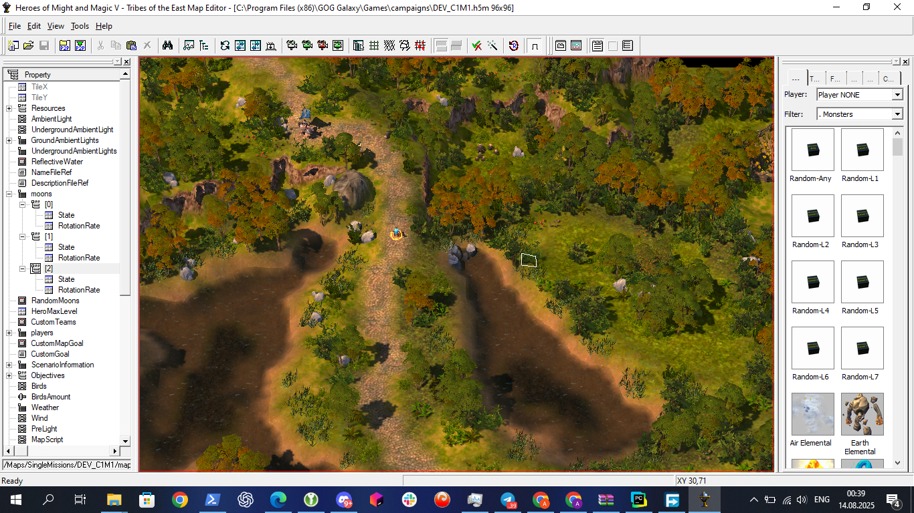

# Campaigns
Campaign compatibility changes for MMH55.

---

## Getting Started

### What’s in this repo
- **Test map:** `DEV_C1M1.h5m` at the repository **root** (use it to verify the conversion pipeline).
- **Campaign sources:** `UserMODs/MMH55-Cam-Maps/Maps/Scenario/<MissionFolder>/…`
- **Script editor:** **HoMM5MapScriptsEditor 1.3.50** (recommended for inspecting/editing map scripts)  
  - Original page: <https://hmm5.sklabs.ru/>  
  - Source code: <https://github.com/HSerg/HoMM5MapScriptsEditor>  
  - A copy is optionally stored here: `HoMM5MapScriptsEditor.1.3.50.zip`
- **Utilities:** 7-Zip/WinRAR for editing `.h5m` archives, and a text/XML editor (Notepad++ / VS Code) for `*.xdb`.

> **Path clarification**  
> Use the **paths from this repository**. The correct mission path is  
> `UserMODs/MMH55-Cam-Maps/Maps/Scenario/<MissionFolder>`  
> Do **not** use a folder name with `.h5u` when working inside this repo (that suffix appears in packaged mod files, not in this layout).

### Repository layout (reference)

~~~text
.
├─ README.md
├─ DEV_C1M1.h5m
├─ HoMM5MapScriptsEditor.1.3.50.zip              # optional convenience copy
├─ git_docs/                                      # screenshots, thumbnails, local videos and docs
└─ UserMODs/
   └─ MMH55-Cam-Maps/
      └─ Maps/
         └─ Scenario/
            ├─ C1M1/
            ├─ C1M2/
            ├─ C1M3/
            ├─ C1M4/
            └─ C1M5/
~~~

Additional code loaded dynamically can be found at
./UserMODs\MMH55-Cam-Maps\scripts
it is two files:
campaign_ai.lua
campaign_common.lua

They are loaded on each map and script.lua header as:
doFile("/scripts/A2_Artifact_Sets/A2_Artifact_Sets.lua"); <-- this is from main 5.5 repo
doFile("/scripts/campaign_common.lua");
doFile("/scripts/campaign_ai.lua");

Types are located at this repository in /git_docs/types.xml
They are extracted directly from MMH55-Frame.pak\types.xml

---

## How to convert a campaign into a single-player map

This is needed if you need to test map and run it in Scenarios mode. 
It is useful for making test runs.

These steps reflect the current process used by contributors.
1) **Ensure environment is correct**
   The MMH5.5 Editor (64-bit) is typically at `[Game]\bin\MMH55_Editor_64.exe`. Open `DEV_C1M1.h5m` to confirm your toolchain works.
   Open this editor, and open test map using: "File -> Open" feature
   If everything correct you will see first mission of Isabell
   
2) **Copy the test map**
   Duplicate `DEV_C1M1.h5m` and rename the copy to `DEV_MY_MAP.h5m`.
    
3) **Rename the internal folder**
   Open `DEV_MY_MAP.h5m` as a zip archive (7-Zip/WinRAR).  
   Change `Maps/SingleMissions/DEV_C1M1` → `Maps/SingleMissions/DEV_MY_MAP`.

4) **Clear the working folder**
   Inside `Maps/SingleMissions/DEV_MY_MAP/`, delete **all** files.

5) **Copy mission files from the repo**
   From this repo, copy everything from:  
   `UserMODs/MMH55-Cam-Maps/Maps/Scenario/<mission_name>/`  
   and paste **into the archive** at:  
   `DEV_MY_MAP.h5m/Maps/SingleMissions/DEV_MY_MAP/`.

6) **Rename the main map file and update the tag**
   - Rename the mission’s main map file from `C1M1.xdb` (or the mission’s original name) to **`map.xdb`**.  
   - Open `map-tag.xdb` in the same folder and change the `AdvMapDesc` line to:

   ~~~xml
   <AdvMapDesc href="map.xdb#xpointer(/AdvMapDesc)"/>
   ~~~

> **When committing changes back to the campaign sources in this repo:**  
> - Rename **`map.xdb` back to the original file name** (e.g., `C1M1.xdb`).  
> - Revert any temporary player changes you made to start the map as a skirmish (see the next section).

---

## Make the converted map start in single-player

Campaign maps require at least two players to start as a skirmish. Activate Player 2 in the map configuration.

1) Open `DEV_MY_MAP.h5m/Maps/SingleMissions/DEV_MY_MAP/map.xdb` (or the internal mission id file if you haven’t renamed yet).  
2) In the `<players>` section, ensure **Player 2** has `ActivePlayer=true`. A minimal known-good item:

~~~xml
<Item>
  <MainTown/>
  <MainHero/>
  <ActivePlayer>true</ActivePlayer>
  <Team>0</Team>
  <CanBeHumanPlayer>true</CanBeHumanPlayer>
  <CanBeComputerPlayer>true</CanBeComputerPlayer>
  <Behaviour>PB_RANDOM</Behaviour>
  <CaptureAbility>0</CaptureAbility>
  <StartHero/>
  <HeroInTown>false</HeroInTown>
  <ReserveHeroes/>
  <AddHeroTrigger><Action><FunctionName/></Action></AddHeroTrigger>
  <RemoveHeroTrigger><Action><FunctionName/></Action></RemoveHeroTrigger>
  <VictoryMessageRef href=""/>
  <DefeatMessageRef href=""/>
  <Race>TOWN_INFERNO</Race>
  <Colour>PCOLOR_RED</Colour>
</Item>
~~~
## Design notes and inspirations tracked:
**Design rule:** keep **Instant Travel** blocked in converted campaign missions (preserves the intended progression and encounter design).

---

## Contributing

Both **fork + PR** and **direct collaborator** flows are supported. When unsure, use **fork + PR**.

### Fork & PR workflow (recommended)

[Fork & PR workflow](https://www.youtube.com/watch?v=-9ftoxZ2X9g "Watch: Fork & PR workflow")

~~~powershell
# 1) Fork https://github.com/Might-Magic-Heroes-5-5/campaigns on GitHub.

# 2) Clone your fork
git clone https://github.com/ACTUAL_DATA_GITHUB_USERNAME/campaigns.git
cd campaigns

# 3) Add upstream (original repo) to sync later
git remote add upstream https://github.com/Might-Magic-Heroes-5-5/campaigns.git

# 4) Create a working branch
git checkout -b ACTUAL_DATA_BRANCH_NAME

# 5) Commit atomic changes
git add -A
git commit -m "C1M3: fix enemy hero army formula; enable tutorial; add Memory Mentor"

# 6) (Optional) Use a specific SSH key on Windows PowerShell
$env:GIT_SSH_COMMAND = 'ssh -i ACTUAL_DATA_SSH_PRIVATE_KEY_PATH -o IdentitiesOnly=yes'
git remote set-url origin git@github.com:ACTUAL_DATA_GITHUB_USERNAME/campaigns.git

# 7) Push your branch to your fork
git push origin HEAD:refs/heads/ACTUAL_DATA_BRANCH_NAME
~~~

Open a Pull Request from your fork/branch to `Might-Magic-Heroes-5-5/campaigns:main`.

**Before submitting a PR**
- Launch the converted `DEV_*.h5m` in-game and verify it starts from the single-player menu.
- Keep **Instant Travel** disabled where the original mission has it disabled.
- In the PR description, note what was tested (e.g., “smoke-tested start; Player 2 active”).

### Direct collaborator workflow

~~~powershell
git checkout -b ACTUAL_DATA_BRANCH_NAME
git add -A
git commit -m "C1M1: tutorial updated for 5.5"
git remote set-url origin git@github.com:Might-Magic-Heroes-5-5/campaigns.git
$env:GIT_SSH_COMMAND = 'ssh -i ACTUAL_DATA_SSH_PRIVATE_KEY_PATH -o IdentitiesOnly=yes'
git push origin HEAD:refs/heads/ACTUAL_DATA_BRANCH_NAME
~~~

**Troubleshooting push/permissions**
- If a browser auth opens and you receive **403**, you likely pushed to the **upstream** repo. Ensure `origin` points to your **fork**, or use SSH with the correct key:  
  `git remote -v` → `origin https://github.com/ACTUAL_DATA_GITHUB_USERNAME/campaigns.git`

---

## How to add Media for documentation (screenshots & clips)

Place media under **`git_docs/`** in this repo.
Examples how to write README:

- **Local MP4 with clickable thumbnail** (thumbnail must also be in `git_docs/`):  
  ``

- **YouTube with custom thumbnail** (thumbnail in `git_docs/`):  
  `[Fork & PR workflow](https://www.youtube.com/watch?v=-9ftoxZ2X9g "Watch on YouTube")`

- **Screenshots from the discussion** (replace file names with actual ones you commit under `git_docs/`):  
  ``  
  ``  
  ``  
  ``

---

## Documentation

General modding knowledge and editor walkthroughs are centralized at the **Heroes 5 Wiki**: <https://heroes5.fandom.com/wiki/Heroes_5_Wiki>.  
Repo-specific guides may also live under `git_docs/` as well as files.

# 1) Creatures lua parsing
python scripts/parse_creatures_to_lua.py \
  --root "C:/Program Files (x86)/GOG Galaxy/Games/campaigns" \
  --types "C:/Program Files (x86)/GOG Galaxy/Games/campaigns/types.xml" \
  --out "C:/Program Files (x86)/GOG Galaxy/Games/campaigns/h55_enums_creatures.lua"

# 2) Spells (updated to Lua)
python scripts/parse_spells.py \
  --root "C:/Program Files (x86)/GOG Galaxy/Games/campaigns/LOCAL_DIR" \
  --types "C:/Program Files (x86)/GOG Galaxy/Games/campaigns/types.xml" \
  --lua  "C:/Program Files (x86)/GOG Galaxy/Games/campaigns/h55_enums_spells.lua"

---

## Changes

### Legend
- **change:** something not broken but behaves different
- **fix:** fix of ToE bug
- **fix(RCXX):** fixed regression from specific MMH55 version
- **new:** new campaign feature

### C1M1 – Haven: The Queen
- fix: Vanilla tutorial is available and updated for 5.5
- fix: on a very rare occasion due to racing conditions mission would not complete

### C1M2 – Haven: Rebellion
- fix: Vanilla tutorial is available and updated for 5.5
- fix: Impossible difficulty was treated as Normal

### C1M3 – Haven: The Siege
- fix: Tutorial is available and updated for 5.5
- fix(RC19c): Enemy hero appeared with 1 imp instead of similar army
- change: enemy hero army formula was based on Isabel army size **OR** a flat limit whichever is higher. This allowed for abuse as the limit value was static and quite low. The limit formula is now based on the weeks passed since start.
- change: As soon as the enemy hero appears, he will try to capture the player town and will target player heroes if they are on his way.
- new: added Memory Mentor
- new: Added a commented ambush battle vs necro units (likely leftover by Nival developers). Winning grants a random minor artifact.

### C1M4 – Haven: The Trap
- fix: Tutorial is available and updated for 5.5
- new: added Memory Mentor

### C1M5 – Haven: The Fall of the King
- fix: Tutorial is available and updated for 5.5
- fix: Siege enemy heroes wander around instead of attacking the castle
- new: added Memory Mentor
