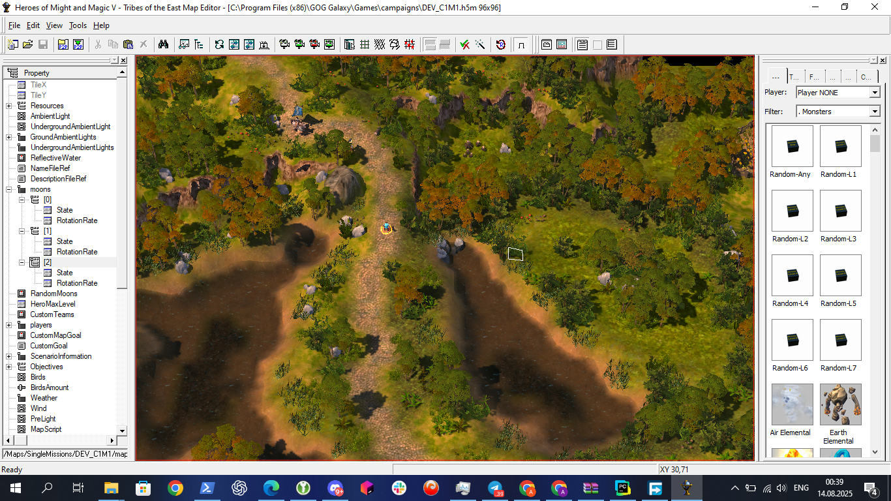

# Campaigns
Campaign compatibility changes for MMH55.

---

## Getting Started

### What’s in this repo
- **Test map:** `DEV_C1M1.h5m` at the repository **root** (use it to verify the conversion pipeline).
- **Campaign sources:** `UserMODs/MMH55-Cam-Maps/Maps/Scenario/<MissionFolder>/…`
- **Script editor:** **HoMM5MapScriptsEditor 1.3.50** (recommended for inspecting/editing map scripts)  
  - Original page: <https://hmm5.sklabs.ru/>  
  - Source code: <https://github.com/HSerg/HoMM5MapScriptsEditor>  
  - A copy is optionally stored here: `HoMM5MapScriptsEditor.1.3.50.zip`
- **Utilities:** 7-Zip/WinRAR for editing `.h5m` archives, and a text/XML editor (Notepad++ / VS Code) for `*.xdb`.

> **Path clarification**  
> Use the **paths from this repository**. The correct mission path is  
> `UserMODs/MMH55-Cam-Maps/Maps/Scenario/<MissionFolder>`  
> Do **not** use a folder name with `.h5u` when working inside this repo (that suffix appears in packaged mod files, not in this layout).

### Repository layout (reference)

~~~text
.
├─ README.md
├─ DEV_C1M1.h5m
├─ HoMM5MapScriptsEditor.1.3.50.zip              # optional convenience copy
├─ git_docs/                                      # screenshots, thumbnails, local videos and docs
└─ UserMODs/
   └─ MMH55-Cam-Maps/
      └─ Maps/
         └─ Scenario/
            ├─ C1M1/
            ├─ C1M2/
            ├─ C1M3/
            ├─ C1M4/
            └─ C1M5/
~~~

Additional code loaded dynamically can be found at
./UserMODs\MMH55-Cam-Maps\scripts
it is two files:
campaign_ai.lua
campaign_common.lua

They are loaded on each map and script.lua header as:
doFile("/scripts/A2_Artifact_Sets/A2_Artifact_Sets.lua"); <-- this is from main 5.5 repo
doFile("/scripts/campaign_common.lua");
doFile("/scripts/campaign_ai.lua");

Arcane Knowledge: How doFile() Paths Work
The doFile() function loads Lua scripts from a root path defined by the game engine.

For a packaged mod (.h5u file), the root is the archive's root.

For a single map (.h5m file), the root is also the archive's root.

This is why shared campaign scripts, which are placed in the /scripts/ folder at the root of the packaged .h5u mod, are called with a leading slash (e.g., doFile("/scripts/campaign_common.lua")). This indicates an absolute path starting from the root of the archive.

Types are located at this repository in /git_docs/types.xml, it is a copy and in future must be linked from MMH5 core repository. For now it is updated manually by maintainers

They are extracted directly from MMH55-Frame.pak\types.xml

---

## How to convert a campaign into a single-player map

This is needed if you need to test map and run it in Scenarios mode. 
It is useful for making test runs.

These steps reflect the current process used by contributors.
1) **Ensure environment is correct**
   The MMH5.5 Editor (64-bit) is typically at `[Game]\bin\MMH55_Editor_64.exe`. Open `DEV_C1M1.h5m` to confirm your toolchain works.
   Open this editor, and open test map using: "File -> Open" feature
   If everything correct you will see first mission of Isabell
   
2) **Copy the test map**
   Duplicate `DEV_C1M1.h5m` and rename the copy to `DEV_MY_MAP.h5m`.
    
3) **Rename the internal folder**
   Open `DEV_MY_MAP.h5m` as a zip archive (7-Zip/WinRAR).  
   Change `Maps/SingleMissions/DEV_C1M1` → `Maps/SingleMissions/DEV_MY_MAP`.

4) **Clear the working folder**
   Inside `Maps/SingleMissions/DEV_MY_MAP/`, delete **all** files.

5) **Copy mission files from the repo**
   From this repo, copy everything from:  
   `UserMODs/MMH55-Cam-Maps/Maps/Scenario/<mission_name>/`  
   and paste **into the archive** at:  
   `DEV_MY_MAP.h5m/Maps/SingleMissions/DEV_MY_MAP/`.

6) **Rename the main map file and update the tag**
   - Rename the mission’s main map file from `C1M1.xdb` (or the mission’s original name) to **`map.xdb`**.  
   - Open `map-tag.xdb` in the same folder and change the `AdvMapDesc` line to:

   ~~~xml
   <AdvMapDesc href="map.xdb#xpointer(/AdvMapDesc)"/>
   ~~~

> **When committing changes back to the campaign sources in this repo:**  
> - Rename **`map.xdb` back to the original file name** (e.g., `C1M1.xdb`).  
> - Revert any temporary player changes you made to start the map as a skirmish (see the next section).

---

## Make the converted map start in single-player

Campaign maps require at least two players to start as a skirmish. Activate Player 2 in the map configuration.

1) Open `DEV_MY_MAP.h5m/Maps/SingleMissions/DEV_MY_MAP/map.xdb` (or the internal mission id file if you haven’t renamed yet).  
2) In the `<players>` section, ensure **Player 2** has `ActivePlayer=true`. A minimal known-good item:

~~~xml
<Item>
  <MainTown/>
  <MainHero/>
  <ActivePlayer>true</ActivePlayer>
  <Team>0</Team>
  <CanBeHumanPlayer>true</CanBeHumanPlayer>
  <CanBeComputerPlayer>true</CanBeComputerPlayer>
  <Behaviour>PB_RANDOM</Behaviour>
  <CaptureAbility>0</CaptureAbility>
  <StartHero/>
  <HeroInTown>false</HeroInTown>
  <ReserveHeroes/>
  <AddHeroTrigger><Action><FunctionName/></Action></AddHeroTrigger>
  <RemoveHeroTrigger><Action><FunctionName/></Action></RemoveHeroTrigger>
  <VictoryMessageRef href=""/>
  <DefeatMessageRef href=""/>
  <Race>TOWN_INFERNO</Race>
  <Colour>PCOLOR_RED</Colour>
</Item>
~~~
## Design notes and inspirations tracked:
**Design rule:** keep **Instant Travel** blocked in converted campaign missions (preserves the intended progression and encounter design).

---

## Contributing

Both **fork + PR** and **direct collaborator** flows are supported. When unsure, use **fork + PR**.

### Fork & PR workflow (recommended)

[Fork & PR workflow](https://www.youtube.com/watch?v=-9ftoxZ2X9g "Watch: Fork & PR workflow")

~~~powershell
# 1) Fork https://github.com/Might-Magic-Heroes-5-5/campaigns on GitHub.

# 2) Clone your fork
git clone https://github.com/ACTUAL_DATA_GITHUB_USERNAME/campaigns.git
cd campaigns

# 3) Add upstream (original repo) to sync later
git remote add upstream https://github.com/Might-Magic-Heroes-5-5/campaigns.git

# 4) Create a working branch
git checkout -b ACTUAL_DATA_BRANCH_NAME

# 5) Commit atomic changes
git add -A
git commit -m "C1M3: fix enemy hero army formula; enable tutorial; add Memory Mentor"

# 6) (Optional) Use a specific SSH key on Windows PowerShell
$env:GIT_SSH_COMMAND = 'ssh -i ACTUAL_DATA_SSH_PRIVATE_KEY_PATH -o IdentitiesOnly=yes'
git remote set-url origin git@github.com:ACTUAL_DATA_GITHUB_USERNAME/campaigns.git

# 7) Push your branch to your fork
git push origin HEAD:refs/heads/ACTUAL_DATA_BRANCH_NAME
~~~

Open a Pull Request from your fork/branch to `Might-Magic-Heroes-5-5/campaigns:main`.

**Before submitting a PR**
- Launch the converted `DEV_*.h5m` in-game and verify it starts from the single-player menu.
- Keep **Instant Travel** disabled where the original mission has it disabled.
- In the PR description, note what was tested (e.g., “smoke-tested start; Player 2 active”).

### Direct collaborator workflow

~~~powershell
git checkout -b ACTUAL_DATA_BRANCH_NAME
git add -A
git commit -m "C1M1: tutorial updated for 5.5"
git remote set-url origin git@github.com:Might-Magic-Heroes-5-5/campaigns.git
$env:GIT_SSH_COMMAND = 'ssh -i ACTUAL_DATA_SSH_PRIVATE_KEY_PATH -o IdentitiesOnly=yes'
git push origin HEAD:refs/heads/ACTUAL_DATA_BRANCH_NAME
~~~

**Troubleshooting push/permissions**
- If a browser auth opens and you receive **403**, you likely pushed to the **upstream** repo. Ensure `origin` points to your **fork**, or use SSH with the correct key:  
  `git remote -v` → `origin https://github.com/ACTUAL_DATA_GITHUB_USERNAME/campaigns.git`

---

## How to add Media for documentation (screenshots & clips)

Place media under **`git_docs/`** in this repo.
Examples how to write README:

- **Local MP4 with clickable thumbnail** (thumbnail must also be in `git_docs/`):  
  ``

- **YouTube with custom thumbnail** (thumbnail in `git_docs/`):  
  `[Fork & PR workflow](https://www.youtube.com/watch?v=-9ftoxZ2X9g "Watch on YouTube")`

- **Screenshots from the discussion** (replace file names with actual ones you commit under `git_docs/`):  
  ``  
  ``  
  ``  
  ``

---

## Documentation

General modding knowledge and editor walkthroughs are centralized at the **Heroes 5 Wiki**: <https://heroes5.fandom.com/wiki/Heroes_5_Wiki>.  
Repo-specific guides may also live under `git_docs/` as well as files.

# 1) Creatures lua parsing
python scripts/parse_creatures_to_lua.py \
  --root "C:/Program Files (x86)/GOG Galaxy/Games/campaigns" \
  --types "C:/Program Files (x86)/GOG Galaxy/Games/campaigns/types.xml" \
  --out "C:/Program Files (x86)/GOG Galaxy/Games/campaigns/h55_enums_creatures.lua"

# 2) Spells (updated to Lua)
python scripts/parse_spells.py \
  --root "C:/Program Files (x86)/GOG Galaxy/Games/campaigns/LOCAL_DIR" \
  --types "C:/Program Files (x86)/GOG Galaxy/Games/campaigns/types.xml" \
  --lua  "C:/Program Files (x86)/GOG Galaxy/Games/campaigns/h55_enums_spells.lua"

# 3) General packing information
## How to package a map for the campaign

After modifying a mission and testing it as a single-player map, you need to package it back into the campaign format to be used in the game's campaign mode.

1.  **Revert Test-Only Changes**: Before packaging, undo any modifications made solely for single-player testing. This typically includes deactivating Player 2 if you enabled them to launch the map as a skirmish.
2.  **Prepare the Folder Structure**: Create a directory structure that mirrors the game's requirements. For example, for mission C1M4, the structure would be `Maps/Scenario/C1M4/`.
3.  **Place Map Files**: Copy your final map files (e.g., `C1M4.xdb`, `map-tag.xdb`) into the mission folder you created (e.g., `C1M4/`). Ensure the `map-tag.xdb` correctly points to the main map file.
4.  **Create the Archive**:
    * Archive the root `Maps` folder into a `.zip` file.
    * Rename the file extension from `.zip` to `.h5u` (e.g., `my_changes_for_C1M4.h5u`).
5.  **Install the Mod**: Place the final `.h5u` file into your game's `UserMods` folder to apply the changes.

## Other Modding Questions (FAQ)

### Can neutral heroes be added in the editor?

No, it is not currently possible to add a neutral hero to a creature stack in the Map Editor, similar to the feature available in QAI for generated maps. This is considered extremely difficult to implement due to the complexity of the feature and a lack of knowledge on the Map Editor's internal workings.

### Where are game object IDs (spells, units, etc.) located?

The name-to-ID mappings for all in-game objects can be found in the `types.xml` file, which is extracted from the `MMH55-Frame.pak` file. This includes IDs for spells, units, towns, adventure map objects, and more.

---

## Gameplay Changes

### Legend
- **change:** something not broken but behaves different
- **fix:** fix of a bug
- **scene(xxx)** changes for campaign scenes/cutscenes. xxx inside brackets denote when the cutscene occurs. Intro/Outro means start/end of mission scene.
- **new:** new campaign feature
- ** Onslaught mode** - refers to heroes with primary and only priority task to charge at enemy towns and/or heroes based on scenario narrative

# Campaign

### Global
- campaigns are now chained, completing Vanilla unlocks HoF, completing HoF unlocks ToE
- added widescreen support for **Dialogues**, **Cutscenes**, **Loading Screens**  (credit Mооnst@r)
- fixed some quests "rewarded" the hero with -100 experience instead of half-to-next-hero-level
- fixed some missions randomly cause the player actions to not get response due to campaign scripts deadlock
- AI heroes will no longer run away from combat
- Enemy heroes serving specific purpose (defender of town, onslaught hero attacking the payer etc..) are now crafted with skills and perks in a way to create specific challenges for the player

### C1M1 – Haven: The Queen
- fix: Vanilla tutorial is available and updated for 5.5
- fix: on a very rare occasion due to racing conditions mission would not complete
- change: garrison army strength scales with game difficulty

### C1M2 – Haven: Rebellion
- fix: Vanilla tutorial is available and updated for 5.5
- fix: Impossible difficulty was treated as Normal

### C1M3 – Haven: The Siege
- fix: Tutorial is available and updated for 5.5
- change: enemy hero army formula was based on Isabel army size **OR** a flat limit whichever is higher. This allowed for abuse as the limit value was static and quite low. The limit formula is now based on the weeks passed since start and increase faster based on diffiuclty.
- change: The final enemy is set to onslaught mode, he will charge at player town and target any player heroes along the way
- new: added Memory Mentor
- new: Added a commented ambush battle vs necro units (likely leftover by Nival developers). Winning grants a random minor artifact

### C1M4 – Haven: The Trap
- fix: Tutorial is available and updated for 5.5
- new: added Memory Mentor

### C1M5 – Haven: The Fall of the King
- fix: Tutorial is available and updated for 5.5
- fix: Siege enemy heroes are now in Onslaught mode as they were often wandering around instead of going for player's town.
- change: "Protect Dunmor" quest - Siege attacks against Dunmor will continue inifinitely (previously were only up to 3) and will stop only when the condition for that has triggered.
- change: Agrael and siege heroes build, stats, skills and army depend and increase with game difficulty
- change: reworked Godric starting level and army
- change: The guardian of Isabel's prison gain more Pit Lords based on game difficulty
- change: Dunmor defending army is now stronger and gets even more so on higher game difficulty levels
- change: "Protect Dunmor" quest - Siege attacks will stop, on normal and hard difficulties - when the Grail is built, on Heroic and Impossible difficulties - when Godric has left.
- change: The garrison blocking the path to Nicolay is now stronger and scales with game difficulty
- new: added Memory Mentor
- new: increased possible grail spawn locations from 3 to 11
- change: level cap increased from 32 to 35

### C2M1 – Inferno: The Betrayal
- change: Level cap increased from 12 to 15
- change: Final fight vs Erasiel are more challenging on higher difficulties

### C2M2 – Inferno: The Betrayal
- change: Final fights vs Stephan and Veyer are now more challenging on higher difficulties

### C2M3 – Inferno: The Conquest
- fix: Druid weekly growth magic did not start unless player captured Wenlan, now that happens on any captured Sylvan town.
- fix: Player 2 heroes no longer flee battles
- change: Reduced amount and power of weekly elven spawns per week due to Elven source magic.
- change: Elder Druids circle fight is now more challenging
- new: Added Memory Mentor

### C2M4 – Inferno: The Ship
- fix: Erewell stopped being reinforced after week 4.
- change: Erewell town is fully developed and reinforcements are now more challenging on higher difficulties
- change: Mines around Erewell are owned by the Preserve player at the start of the game.
- change: Preserve heroes (Dirael, Wyngaal, Alaron) stats and starting army are now more challenging
- change: Inferno hero Erasiel stats and army are now more challenging
- new: Added Memory Mentor

### C2M5 – Inferno: Agrael's Decision
- change: The creature stack defending Tieru bridge scales with difficulty
- new: Added War Machine factory on the map

### C3M1 – Necropolis: The Temptation
- fix: Enemy hero Amin did not patrol the map as inteneded
- changed: Academy heroes tracking works on all difficulties (was heroic and impossible) but their detection range is now shorter on lower difficulties (from 0/0/13/15 to 8/10/12/14).
- changed: Starting bonus choice set from 20 Skeletons, Breastplate of Eldritch Might, Curse spell to 30 Skeletons, Helm of Chaos, Rupture spell

### C3M2 – Necropolis: The Attack
- fix: Certain player movement could make patrols halt and stop at place indefinitely
- fix: Enemy patrol ships attacking the player hero triggered multiple combats one after another instead of one

### C3M3 – Necropolis: The Invasion
- fix: Sometimes player heroes were not granted Cloak of Death's Shadow when visiting Bahiyaa
- change: Cloak of Death's Shadow and Staff of the Netherworld are given only when Markal visits Ziyad and Bahiyaa instead of any player hero. That is reflected in quests description
- new: Added Memory Mentor

### C3M5 – Necropolis: Lord of Heresh
- fix: Godric's Angel trap sometimes did not trigger which broke the main quest line
- fix: Renegade upgrade type units did not run away from Isabella. Now they are and Godric receives them as True upgrade type reinforcements for the final battle
- change: Godric reinforcement mechanic now scales with difficulty level.
- change: When Godric sabotage troops take ownership of a player mine the player camera will showcase the location
- change: Player3 (Academy) heroes are now in Onslaught mode, they will aim to take over player's towns at any cost
- new: Added Memory Mentor

### C4M1 – Dungeon: The Clanlord
- change: Improved army power of some contestants (Erina, Vayshan,Yrbeth)

### C4M2 – Dungeon: The Expansion
- fix: Removed an undeground Vampire lords stack as it could not be attacked nor it guarded any treasures
- fix: Dungeon messenger heroes sometimes stuck at top of the map and jam the secondary mission progress

### C4M3 – Dungeon: The Cultists
- fix: Red AI player (Inferno) heroes are now in Onslaught mode, they will charge at player towns and heroes instead of wandering around the map
- fix: Red AI player (Inferno) heroes sometimes froze and stopped moving till end of the game
- fix: Blue AI player (Dungeon) and Red AI player (Inferno) heroes were fleeing midcombat. Now they will fight to the very end.
- fix: multiple MMH55 script bugs frequently caused engine crash and prevented mission objectives from completion
- fix: Shadya artifacts were not transferred from the previous mission
- new: Added Memory Mentor

### C4M4 – Dungeon: The March
- fix: Storyline enemy is Grawl but the actual in-game hero was Alastor

### C4M5 – Dungeon: Raelag's Offer
- fix: an undeground Poltergeist stack is now removed as it could not be attacked nor it guarded any treasures
- change: Veyer final fight is more challenging and scales with game difficulty

### C5M1 - Sylvan: The Refugees
- fix: Orson onslaught hero could not spawn and attack because he was already present on map
- fix: Onslaught heroes did not attack or rarely attack any posts due to bug into ToE engine
- change: Biara army size increased

### C5M3 - Sylvan: The Defense
- change: Disabled "Summon Boat" spell on map so Purple player cannot cross the river (Findan already has the spell).
- change: Disabled Purple player from hiring heroes in Syris Thalla.
- change: Purple player onslaught heroes will spawn only when none are present and he has no control over Syris Thalla.
- change: Dirael and Talanar skills and stats adjusted to fit class changes
- change: Dirael and Talanar prison guards are more challenging
- fix: Purple player oslaught heroes sometimes did not appear and attack Syris Thalla.
- fix: "Prepare the garrison" quest did not always count some base/upgrade type of Druids, Unicorns, Dragons.
- fix: "Prepare the garrison" quest did not count units in heroes at the town gate unless it is Findan.
- new: Added Memory Mentor

### C5M4 - Sylvan: The Archipelago
- new: Added Memory Mentor
- new: added a naval fight ( originally prepared by Nival but was never introduced in the scenario )
- change: Inferno heroes army is now stronger and will scale up with every month that passes by

### C5M5 - Sylvan: The Vampire Lord
- fix: Nikolay occasionally transferred his army to other heroes due to AI not considering him the main player hero.
- fix: Necropolis player heroes no longer flee from combat and fight till the very end.
- change: Nikolay hero has better stats, knows more spells and his army scales with game difficulty.
- new: map ambient light did not changed properly as the night drew near. Now the dusk will gradually become darker. If the player manages to break the dragons causing the night, daylight will shine bright.
- new: Combat arena light and Skydome reflects the one on the adventure map.
- new: Message will notify the player when the night countdown is at 40%, 20% and when the night comes
- new: Camera will go through the locations of all player visible Spectral Dragons when the night counter is at 60%.
- changed: Night counter increases faster at higher difficulty levels 0%, 25%, 50% and 75% for impossible.

### C6M2 - Academy: The Liberation
- fix: It was possible to get the outro cinematic if you directly capture Lorekeep. Now that happens only when all main objectives are accomplished.
- fix: AI hired and cluttered many heroes on the Lorekeep island for no reason. 
- changed: Angel creature stack guarding Lorekeep island from the left side now grows every week.
- new: Lorekeep now has a hero that guards it (was empty before) and his army power scales with difficulty level.
- new: Added Memory Mentor

### C6M3 - Academy: The Triumvirate
- fix: final Markal fight (vs Findan) used dummy Markal hero instead of the one importred from C3M5
- change: First garrison troop strength increased by 30%
- change: Haven towns are now of higher town level:
   - Dwellings: T1, T2, T3, T4, T5 built up to level 1 (provide non upgraded units).
   - Magic Guilds from level 0 to 3
   - Common buildings: Village is now Town Hall, added Marketplace, added Blacksmith, Taverns cannot be built.
- change: Markal fights are now more challenging, scale with game difficulty and time passed.

### C6M4 - Academy: The Alliance
- fix: archer dwelling (at 150,148) could not transport units via caravan due to terrain block
- new: Added Memory Mentor
- change: Isabel army size significantly increased and is based on difficulty
- change: All enemy garrisons are significantly stronger

### C6M5 - Academy: Zehir's Hope
- new: Added Hill Fort on the map and the player starts with 500000 gold so he can better strategise the fights.
- changed: Reworked Biara and Sovereign fights, they are significantly stronger on higher difficulties.
- changed: Buffed Godric's army as his army value was considerably lower then the other heroes.
- changed: Increased Magic Wall health from 500 to 750

### A1C1M1 - Freyda: Rebels
- fix: Overlapping messages during troop desertion made them unreadable
- change: level cap increased from 12 to 15
- change: Freyda starting army increased
- change: Caldwell and Randell enemy hero armies are now more challenging on higher difficulties

### A1C1M2 - Freyda: The Suspicion
- change: final inferno attack is now more challenging on higher difficulties

### A1C1M3 - Freyda: Duncan
- new: Teal enemy player now has a layered defense by a triage of heroes and garrisons and Duncan sits at the very core if it. Enemy armies are stronger on higher game difficulty.
- fix: Teal enemy player sabotage groups against Freyda was not working as intended. Now town recruits will desert, mines will get stolen, rebel forces will appear on map to block pathing.The chance to get one mine stolen at the start of the day (5%/6%/8%/10% per owned mine by the player).
- change: level cap increased from 28 to 30
- change: Duncan town is now more fortified
- change: Inferno ambushes are now more challenging on higher difficulty levels.

### A1C1M4 - Freyda: Negotiations
- new: Added Memory Mentor

### A1C1M5 - Freyda: The Choice
- new: Added Memory Mentor
- change: Once you free Duncan he will gain exp to reach level 30.
- change: Starting Freyda's army is now stronger considering the 80% of the size required to go to Thor Hrall in previous mission (same for all difficulties)
- change: Red Heaven player hero Lorenzo is deployed at Castlegate, with a role of town defender. His level depends on game difficulty.
- change: Red Heaven player hero Andreas level and army power depend on game difficulty. 
- change: Teal Heaven player heroes Klaus and Rutger levels depend on game difficulty.
- change: Mission final naval combat is now more challenging on higher difficulty levels.

### A1C2M1 - Wulfstan: The Borderzone
- change: Starting bonus set from 15 defenders, 5 bears, 5 berserkers to 15 axe throwers, 10 bears, 7 berserkers.
- change: Raised level cap from 14 to 20
- change: Red Heaven onslaught waves have been redesigned and are more challenging on higher difficulties.

### A1C2M2 - Wulfstan: The Ambush
- change: Enemy hero leading the final attack is more challenging on higher game difficulty.
- change: Lich stack with hidden army at Dungeon entry is more challenging on higher game difficulty.
- change: Raised level cap from 22 to 25.
- new: Added Memory Mentor

### A1C2M3 - Wulfstan: The Guerrillas
- fix: Enemy hero Andreas did not patrol the underground as intended
- fix: Quest Caravan occasionally did not appear which made the mission unable to complete.
- fix: Asking the underground dwarves to lure enemy hero Andreas made them also joining him on visit instead of getting sacrificed.
- change: Enemy hero Andreas (patrol) is now more challenging on higher difficulty levels.
- change: Enemy hero Valeria (town guard) is now more challenging on higher difficulty levels.
- change: Quest Caravan acompanying army is now more challenging on higher difficulty levels.
- change: Reduced Quest Caravan travel time changed from 4 days to 7/6/5/4 days based on difficulty level
- new: Added a Hill Fort that is available to the player

### A1C2M4 - Wulfstan: Two Brothers
- fix: Enemy hero interacting with scripted creatures invoked player recruiting dialogue instead of invoking a fight
- fix: Duncan artifacts from mission A1C1M5 were not loaded
- change: Torhall final siege combat is now more challenging on higher difficulty levels.
- change: Enemy hero Rolf army is now more challenging on higher difficulty levels.
- change: Replaced Cartographer with Memory Mentor

### A1C2M5 - Wulfstan: Laszlo
- fix: Duncan artifacts from previous mission were not loaded
- fix: Dwarven Treasury could not be entered/attacked.
- change: Laszlo is now is now more challenging on higher difficulty levels and will agressively attack the player as intended

### A1C3M1 - Ylaya: The Spy
- change: Raised level cap from 14 to 20
- change: Hut of the Magi quest marked units power and reward scale with game difficulty

### A1C3M2 - Ylaya: The Break
- change: Raised level cap from 22 to 25

### A1C3M3 - Ylaya: The Meeting
- fix: unreachable resource pile near the town towards the north
- change: Raised level cap from 30 to 32
- new: Added Memory Mentor

### A1C3M4 - Ylaya: The Dragons
- change: Soulscar heroes roamed and collected resources, dwellings, mines instead of charging player garrisons or towns
- change: Soulscar hero waves consist of 2 heroes that attack together
- change: Thralsai and his army are now more challenging on higher difficulty levels.

### A1C3M5 - Ylaya: The Decoupling
- fix: Duncan and Wulfstan artifacts from mission A1C2M5 were not loaded
- change: Horncrest town is nearly fully developped
- change: Horncrest siege enemy hero Lorenzo power and surounding neutral stacks are now more challenging on higher difficulty levels.
- change: Lostdale siege enemy hero Andreas level increased
- change: Lostdale town receive more reinforcements each week + additional from day 1 based on difficulty
- change: King Toulghar level increased and his army is now more challenging on higher difficulty levels.
- change: Increased the strength of Inferno garrisons
- change: Inferno towns now have heroes serving as protectors who will guard the towns at all cost.
- change: Inferno enemy will spawn Marbason the first day of the week after Horncrest has been conquered by the player. Marbas will start an osnalught against the player and if defeated he will respawn on the following week to continue to do so. The attacks will stop once the Inferno player is fully defeated.
- change: Increased the strength of Dwarf garrisons
- change: Increased the strength of Red Heaven garrison peasants from 10k to 12k
- change: Increased the strength of Red Heaven units and dwarves that guard mines.
- new: Removed Tavern from inferno towns; will be exchanged to deploy additional 2 inferno Heroes (need to be added)
- new: Added Memory Mentor

### A2C0M0 - Rage of The Tribes: A Murder of Crows
- fix: Removed wandering enemy player hero.
- changed: Voron Peak defending army is more challenging on higher difficulty levels.

### A2C1M1 - The Will of Asha: Last Soul Standing
- change: Removed tutorial messages as player has already been introduced to Necromancy in previous missions.
- change: Reduced amount of defenders (difficulty increase) for troops in the first Necro town.
- fix: Iluma-Nadin town was not revealed as primary quest target at game start.
- fix: Objective buildings (Forge, Which Hut, Portal) triggered messages for the human player when visited by the AI player heroes.
- fix: Ornella artifacts were not transferred to her Necromancer version at the end of the mission

### A2C1M2 - The Will of Asha: The Grim Crusade
- change: enemy heroes Faiz and Gamor armies are now more challenging on higher difficulty levels.
- change: Raised level cap from 22 to 25

### A2C1M3 - The Will of Asha: The Bull's Wake
- change: Removed human player tavern hiring limit ( was 6 )
- change: Enemy hero Orlando is now more challenging on higher difficulty levels

### A2C1M4 - The Will of Asha: Beasts and Bones
- fix: Stronghold onslaught heroes would stop spawning if the current wave hero was not killed in less than 7 days after he has spawned
- fix: capturing all Gold mines would not complete the related quest
- fix: Units from Inferno town could be taken by Inferno onsalught heroes
- changed: Inferno wave heroes army are now more challenging on higher difficulty levels and scale with time.
- changed: Stronghold wave heroes are now more challenging on higher difficulty levels and scale with time.

### A2C1M5 - The Will of Asha: The Bull's Wake
- fix: Camera angle on Arantir caravan with reinforcements was messed up
- change: Raised level cap from 40 to 99
- change: Orlando army is now more challenging on higher difficulty levels and scale with time.
- change: Enemy Haven towns are now fully built
- change: Infernal heroes that spawn from the demon portal are now in onlaught mode and will prioritize closest player owned town

### A2C2M1 - To Honour our Fathers: Collecting Skulls
- change: reduced skulls granted by castle and by goblins on higher difficulties
- change: reduced army size on some creature stacks on adventure map

### A2C2M2 - To Honour our Fathers: One Khan, One Clan
- fix: Dungeon pirate heroes sometimes jammed and stopped moving.
- fix: Stronghold Tribe harassment waves against the player did not work at all
- change: AI harassment waves changed from 3 to infinite where each next wave is stronger
- change: Raised level cap from 22 to 30
- change: Experience yield increased from 0.45 to 0.7
- change: Buffed Kujin starting army
- change: The first three tribe chiefs that join will gain 10/15/20 levels instead of starting at level 1.
- change: The Cyclops guards count that eventually join Kujin increased from 3 to 12/10/8/6 based on game difficulty.
- change: Final fight hero Gork gains all warcries and his level scale with game difficulty.

### A2C2M3 - To Honour our Fathers: Father Sky's Fury
- fix: bug prevented catapult shots to raze towns
- change: Catapult shot cost from 15 to 20/40/60/80 (based on difficulty)
- change: Catapult shots required to raze a town from 3 to 5
- change: Enemy heroes are more experienced on higher difficulties
- change: Blue player town Sheller and red player town Greystone are considered strongholds and will never be left unguarded
- change: Heroes guarding Sheller and Greystone will become onslaught heroes if they survive town destruction.

### A2C2M4 - To Honour our Fathers: Mother Earth's Wisdom
- fix: Quest Huts asked questions before their dialogs were played
- change: Alastor final fight is now more challenging on higher difficulty

### A2C2M5 - To Honour our Fathers: Hunting the Hunter
- fix: sometimes Alaric did not appear which prevented the questline to move forward
- fix: Sawmill at 146,4 was inaccessible due to wrong pathing mask
- change: The army defending mage town is now more challenging on higher difficulty levels
- change: Alaric and his army are now more challenging on higher difficulty levels
- change: Alaric will now more agressively chase player heroes and conquer his towns

### A2C3M1 - Flying to the Rescue: Dark Ways and Deeds
- fix: Quest to find and deliver the Dwarven Smithy Hammer artifact would resolve only if Zehir was carrying the artifact
- change: Zehir skills and stats are now transfered from his last mission Zehir's Hope
- change: Summoning Ilkhm town will consume Zehir XP and bring him to level 10 as well as scale down his stats

### A2C3M2 - Flying to the Rescue: Tearing the Veil
- fix: Sometimes not all affiliated heroes/mines/dwellings were transfered to the player when bottom left Heaven town capitulated

### A2C3M3 - Flying to the Rescue: Summoning the Dragon
- change: Enemy onslaught heroes are more experienced, come in variety of class flavours and their army strength now depend on game difficulty
- change: Starting on week 3, enemy town gets weekly reinforcements that depend on game difficulty

### A2C3M4 - Flying to the Rescue: A Flamboyant Exit
- fix: Dungeon player heroes could not access the Subterranean gate (at 69, 152) and thus gain access to mines and resources.
- change: Revoked Dungeon player heroes access to portal (76, 126).
- change: Gottai replaces Kujin in the inferno town siege.
- change: Talonguard garrisons guards increased to 400k Ims and 1000 ArchDevils. It is up to the player to find a way to the town.
- change: Biara reinforcement groups now arrive 1 month earlier for each difficulty level above normal. Arrival time changed from months 4 and 5 to months 4,5/3,4/2,3/1,2 based on game difficulty.
- change: Siege led by Ylaya is now more challenging on normal difficulty.
- change: Adventure map guards for locations (keymasters, dwarven treasuries, gold mines etc..) related to questline progression are now more powerful based on difficulty.
- change: Inferno portal guardian heroes (Nymus, Marbas, Deleb) level and army now scale with difficulty.

## Dialogue changes

Changes that affect quality of dialogue scenes or lore. Credit goes to Rommy and Mооnst@r from the [Remastered Campaigns project](https://forum.heroesworld.ru/showthread.php?t=18706).

- Added Widescreen support for loading screens, cinematics and dialogues.

### C1M1 – Haven: The Queen
- scene(intro): Footman die from Succubus retaliation and then they are seen alive in the next camera shot. Now Footman are just damaged. Cavalry die animation was shown at Pit Lord Meteor Shower cast when they were already dead. Modified the timings of some scenes for better immersion.

### C1M2 – Haven: Rebellion
- scene(intro): Removed overly green fog ambience
- scene(capture Ashwood): Removed overly green fog ambience

### C1M3 – Haven: The Siege
- scene(clear scouts): Footman cheer animation is now in sync with Isabel's one

### C1M4 – Haven: The Trap
- scene(boots of Levitation): Added missing Isabel's sword animation effect

### C1M5 – Haven: The Fall of the King
- scene(intro): Added missing Freyda cheer animation when she agrees with Godric
- scene(Isabell going to Nicolai): Added missing Isabel sword animation during cast. Removed double buff sound. Adjusted angle so camera will not dip below terrain level.

### C2M1 – Inferno: The Betrayal
- scene(spot Erasiel): Scene showed enemy as Agrael instead of Erasiel

### C2M2 – Inferno: The Promise
- scene(clash with Haven army): Added missing Griffin flying animation at the end of scene

### C2M3 – Inferno: The Conquest
- scene(defeat Gilraen): Remove overly fog ambience
- scene(intro): Added Observatory doodad and Agrael happy animation
- scene(capture Sylvan city): Added a Tree of Knowledge doodad
- scene(at first week of Sylvan growth): Added a Tree of Knowledge doodad
- scene(attack druids): Added missing stone circle doodads
- scene(deafeated druids): Added missing stone circle doodads

### C2M4 – Inferno: The Ship
- scene(intro): Added missing Observatory doodad.
- scene(meet dragons): Improved Dragon entrance animation timing.
- scene(meet dragons): Added missing attack animation at dragon entrance
- scene(deserting units): Added mountain and misc doodads in the background
- scene(capture Nebyrciaz): Added missing Agrael cast animation

### C2M5 – Inferno: Agrael's Decision
- scene(step in void): Added new scene removed since Vanilla. It is played when Agrael steps close to the fog of war on some places on the map. He is consumed by it and thus defeated.
- scene(outro): Removed overly green ambience

### C3M1 – Necropolis: The Temptation
- scene(intro): Removed overly foggy ambience
- scene(Markal death): Added missing Markal spell effect during cast
- scene(reach Vigil): Adjusted camera height so scene so Markal stays in frame.

### C3M2 – Necropolis: The Attack
- change: Final battle with Nur in Hikm is now more challenging and scale with difficulty. 

### C3M3 – Necropolis: The Invasion
- scene(gather skeletons): Slightly adjusted camera set movement to sync with army cheer

### C3M5 – Necropolis: Lord of Heresh
- scene(intro): Added missing sound of Godric being hit by archer arrows. Blind effect cast on archers was positioned too low.
- scene(at prison): Added missing Freyda reaction after Markal cast

### C4M1 – Dungeon: The Clanlord
- scene(intro): Added grass and mountain doodads. One of the riders behind Raelag was "happy" insead of sitting idle.

### C4M2 – Dungeon: The Expansion
- scene(intro): Improved Raelag and Matron idle animation pace.
- scene(meet Shadya): Improved Raelag idle animation pace.
- scene(messengers escape): Adjusted camera angle to show Raelag talking instead of pointing at the empty sky.
- scene(grail in town): Added missing Raeleg spell effect during cast.

### C4M3 – Dungeon: The Cultists
- scene(Inferno arrival): Added missing spell effect during Raeleg cheer
- scene(Inferno defeated): Added missing spell effect during Raeleg cheer

### C4M5 – Dungeon: Raelag's Offer
- scene(outro): Fixed endless hoof movement sound. Fixed Markal was seen in camera before he arrives.

### C5M2 – Sylvan: The Emerald Ones
- scene(dragons assembled): Adjusted camera height to keep Findan inside frame

### C5M3 – Sylvan: The Defense
- scene(capture town): Dragons were seen in camera view before they arrived in combat
- scene(free both heroes): fixed both hero models were using Diraya female, now the second hero model is Findan's as it should.

### C5M4 - Sylvan: The Archipelago
- scene(defend Tieru): Camera angle adjacent to show Findan instead of the sky above him
- scene(Tieru death):  Biara's Meteor Shower that kills Tieru is presented properly
- scene(outro): Biara escape spell effect was not properly shown

### C5M5 - Sylvan: The Vampire Lord
- scene(intro): Sound volume was too high
- scene(messenger): We added back a broken scene that was supposed to trigger at start of month 2 but never did in MMh55 or original game due to Nival bug. Findan sends a messenger to Zehir to warn him of the great danger.
- scene(outro): Added missing spell effect for Findan at the end

### C6M3 - Academy: The Triumvirate
- scene(intro): Added missing idle animation which caused Narxes to T-pose
- scene(prison): Added missing bash sound when godric hit his shield

### C6M4 – Academy: The Alliance
- scene(meet Raelag): camera is now showing Godric, Findan and Zehir while talking instead of the sky above them
- scene(outro): added missing scene after Isabel is defeated

### C6M5 – Academy: Zehir's Hope
- scene(outro): added original Vanilla cinematic after mission ends where Godric and corrupted Isabel return to the destroyed castle.

### A1C1M1 - Freyda: Rebels
- scene(intro): Alaric speech animation
- scene(ambush): Freyda reaction timing when soldier is killed

### A1C1M2 - Freyda: The Suspicion
- scene(intro): Alaric speech animation
- scene(intro): Peasant convertion to Horned Daemons was not in sync and looked weird
- scene(burnt hut): Alaric speech animation
- scene(outro): Added originally discarded dialog after the mission ends where Elrath brings clarity to Freyda mind with visions about Biara impersonating the queen

### A1C1M3 - Freyda: Duncan
- scene(intro): leading peasant happy animation duration was too short
- scene(outro): Alaric speech animation

### A1C1M4 - Freyda: Negotiations 
- scene(intro): Alaric speech animation

### A1C2M2 - Wulfstan: The Ambush
- scene(outro): Corrected Rolf's camera position as Isabel's model was visible on the widescreen monitor before she appeared.

### A1C2M5 - Wulfstan: Laszlo
- scene(outro): Removed an incorrect English phrase in the final cutscene of the fifth mission.

### A1C3M5 - Ylaya: The Decoupling
- scene(Alaric withdrawal): Alaric speech animation
- scene(outro): Alaric speech animation

### A2C1M1 - The Will of Asha: Last Soul Standing
- scene(find key part, visit which): Removed Ornella being teleported as she was already present at the correct place. Jovani rotation adjusted to face Ornella when talking.
- scene(through portal): Removed Ornella being teleported as she was already present at the correct place.

### A2C1M4 - The Will of Asha: Beasts and Bones
- scene(orc trap): Scene heroes were not returned to their original map locations

# SINGLE SCENARIO MAPS
- AI players visiting H55 interactable objects showed flying messages to the human player on many single scenario maps.
### The Union (A1S3)
    - fix(outro): dialog participants were not facing each other
### New Enemies (A1SM1)
    - fix(outro): dialog participants were not facing each other
### In Search for Power (A1SM2)
    - change: Instant travel spell is no longer available on this map.
### Iron Throne (A1SM4)
	- none
### Temptation (A1SM5)
    - change: Instant travel spell is no longer available on this map.
### Maahir's Gambit (SL1)
    - change: Instant travel spell is no longer available on this map.
### An Island of One's Own(SL2)
    - fix: Onslaught heroes were sailing in sea aimlessly, now they will try to conquer the town closest to them and settle there.
    - fix(cinematics): camera was not properly showing the onslaught arrivals 
### A Tear of Ossir (SL3)
    - fix: Signs were broken and mission could not be completed
    - fix(cinematics): Sign 6 dialog camera was not showing conversation participants but was looking at the sky.
### Defiance (SM2)
    - change: Nadaur is in onslaught mode, meaning  he will assault player heroes and towns until defeated.
### Diplomat (SM3)
    - change: Instant travel spell is no longer available on this map.
### Dragon Knight (SM5)
	- fix: Red quest demands were different then the one presented to the player.
	- change: Vittorio start the game with Ballista
	- change: Instant travel spell is no longer avialable on this map.
### Hot Pursuit (SM6)
	- fix: Siege inferno stacks in front of the Sylvan town remained even if the message said the Inferno siege forces are now gone.
	- fix: Cinematics used Agrael hero model but it is Grok that is in play
### Falcon's Last Flight (SS2)
	- fix: Jezbeth and Maeve occasionally T-posing in cinematics
### Refugee (SXL1)
	- fix: cinematics where Yrbeth appears next to the Dragonteeth artifact sometimes did not complete and blocked the game.
### The Days of Fire (A2S2)
    - fix: Removed Unicorn Horn Bow and Treeborn Quiver from vault rewards as they are part of a questline
	- fix(cinematics): Treant T-posing instead of having a dead posture in the intro scene
### Hate Breeds Hate (A2S3)
    - fix: Removed Tome of Destruction from vault rewards as they are part of a questline
    - fix: Fortress Military Outpost was not interactable which prevented its related secondary quest from completion
### Agrael's Trial (A2S4)
    - change: Inferno assault behavior now scales with difficulty, with higher difficulties making enemy heroes more likely to actively hunt player heroes and towns.
    - fix: The Witch curse is correctly consumed by the next successful assault wave instead of being cleared when no new hero was deployed.
### Battle of Cry Freedom (A2S5)
  - fix: cinematics after defeating the Academy did not show the opening of the sea path
  - fix: increasing game difficulty also increased human player starting army
  - fix: Haven AI player spawned additional heroes which messed up the town defense army and the main hero army distribution.
  - change: returned back plunder effect when capturing Peasant hut dwellings